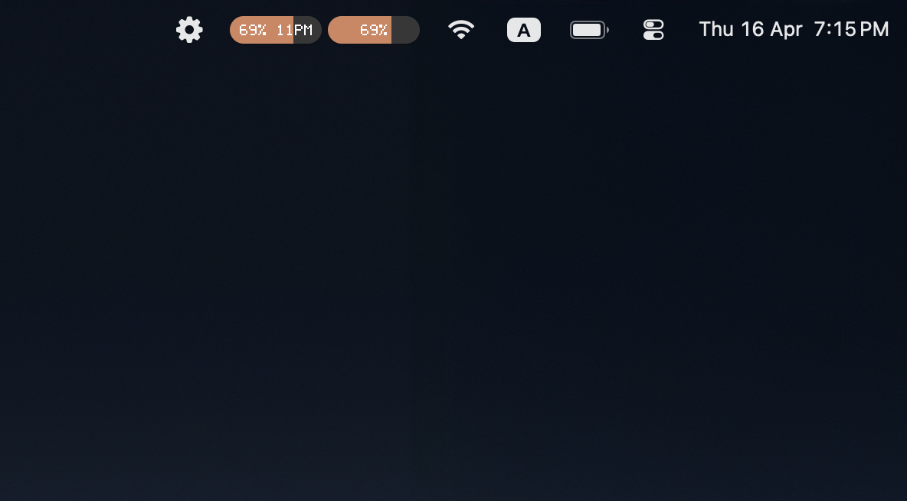
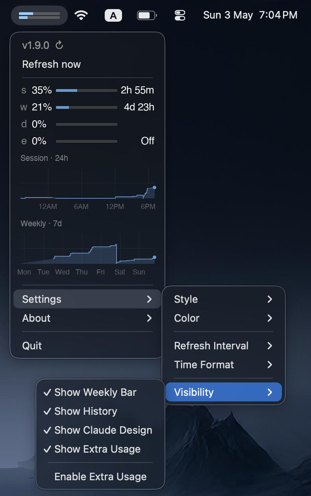

# Claude Usage Monitor

[](LICENSE)
[](#)

Your Claude session and weekly limits as progress bars in the macOS menu bar, so you stop opening a browser tab just to check.




## Why

I kept a Claude tab pinned just to see how close I was to the weekly limit, and I got tired of it. Now it's in the menu bar.

## How it works

A small daemon grabs your Claude session cookie from the browser, hits the Claude API, and writes the result to a file. A native macOS status bar app reads that file and draws the bars.

You don't paste tokens anywhere, and there's no browser extension. If you're signed into [claude.ai](https://claude.ai) in a browser, it works.

## Requirements

- macOS
- [Homebrew](https://brew.sh)
- Browser (Chrome, Brave, Arc), signed into claude.ai

## Install

```bash
git clone https://github.com/ncreasor/claude-usage.git
cd claude-usage
./install.sh
```

The installer grabs Python 3.13 via Homebrew if you don't have it, starts the background daemon, and launches the status bar app.

A launcher is also created at `~/Applications/Claude Usage.app` — double-click it or find it via Spotlight to relaunch the app without running the installer again.

## Settings

Click the progress bars in the menu bar to open the dropdown, then go to **Settings**.

| Setting | Options |
|---|---|
| Style | Standard (`65% ──── 2h`), Compact (two thin bars, no text), or Text (`65%  32%`) |
| Color theme | Orange, Blue, Green, Purple, Red, Teal, Pink, Yellow |
| Refresh interval | 1, 2, 5, 10, 15, or 30 minutes |
| Time format | Rounded (`5m`, `2h`) or Exact (`4m`, `1h 23m`, `2d 6h`) |
| Visibility | Show/hide: Weekly Bar, History charts, Claude Design bar, Extra Usage bar; enable/disable Extra Usage |

Saved to `~/.claude-usage/config.json`.

## Uninstall

```bash
./uninstall.sh
```

Stops the daemon and the status bar app, and asks whether to clear cached data.

## Privacy

All network requests go to Anthropic only — no third-party server, no telemetry, nothing else phones home. Endpoints used:

- `GET /api/organizations/{id}/usage` — session and weekly usage
- `GET /api/organizations/{id}/prepaid/credits` — account balance (Extra Usage bar)
- `GET/PUT /api/organizations/{id}/overage_spend_limit` — extra usage toggle

To read your usage, the daemon opens the browser's local cookie database — the same cookies the browser itself sends to claude.ai on every page load.

If you want to check, the entry points are [server.py](server/server.py), [claude-usage.py](displays/systray/claude-usage.py), and [claude_shared.py](claude_shared.py). You can read it end to end in a few minutes.

## Logs

```bash
tail -f ~/Library/Logs/claude-usage.log          # daemon
tail -f ~/Library/Logs/claude-usage-systray.log  # status bar app
```

## Roadmap

Settings
- [x] Styles & Colors
- [x] Refresh interval
- [x] Time format
- [x] Getting updates
- [ ] Languages

AI
- [x] Claude
- [ ] ChatGPT
- [ ] Grok

Browsers
- [x] Chrome
- [x] Arc
- [x] Brave
- [ ] Safari
- [ ] Firefox

Modes
- [x] Subscription
- [ ] API

OS
- [x] macOS
- [ ] Windows

## Contributing

Issues and PRs welcome — see [CONTRIBUTING.md](CONTRIBUTING.md) for details. If it's useful to you, a ⭐ genuinely helps other people find it.
